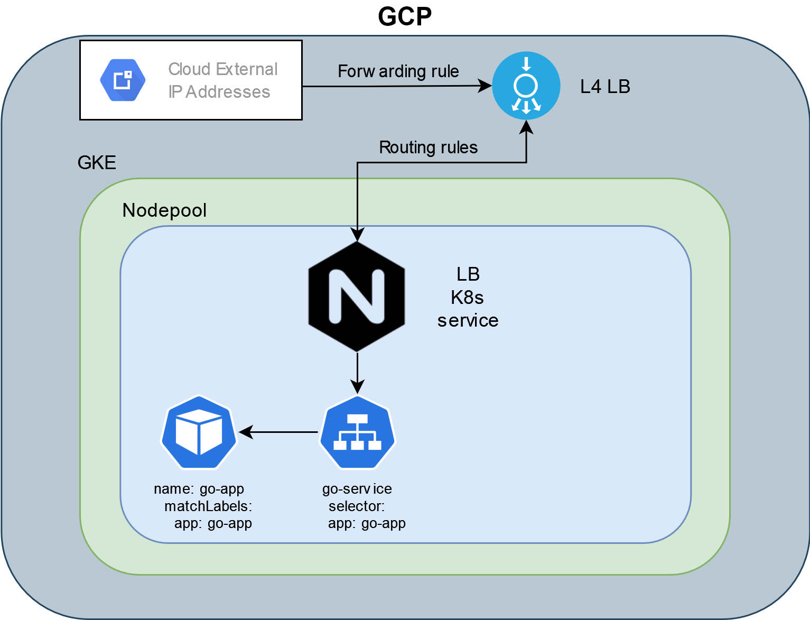
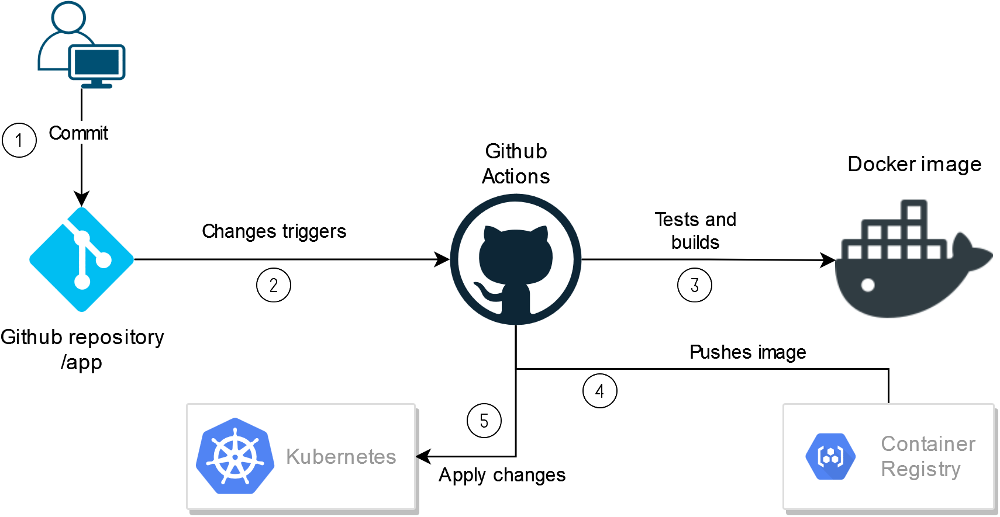
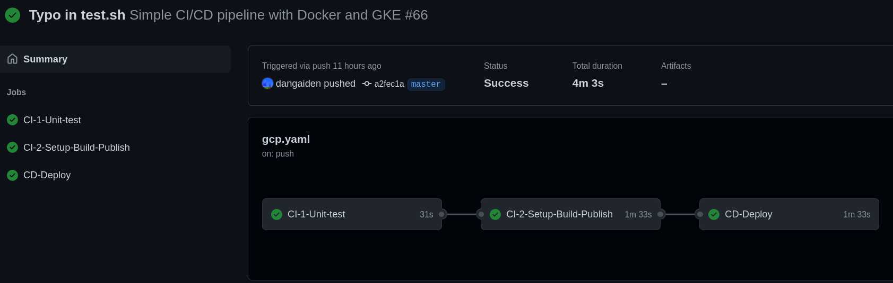
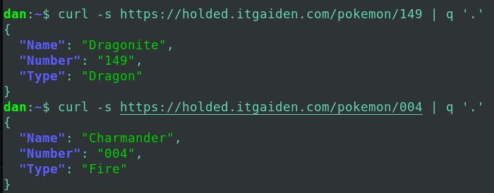
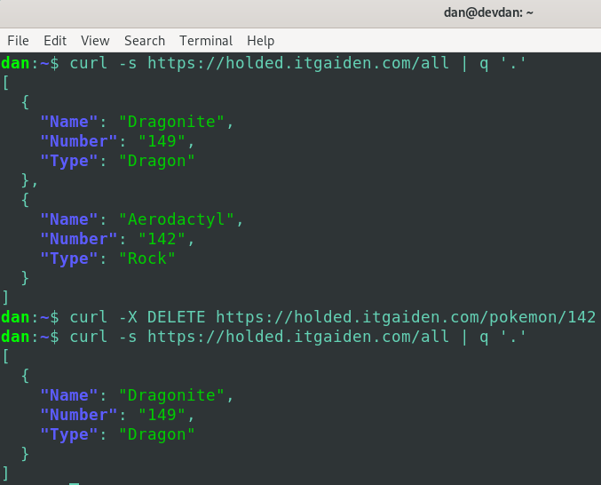
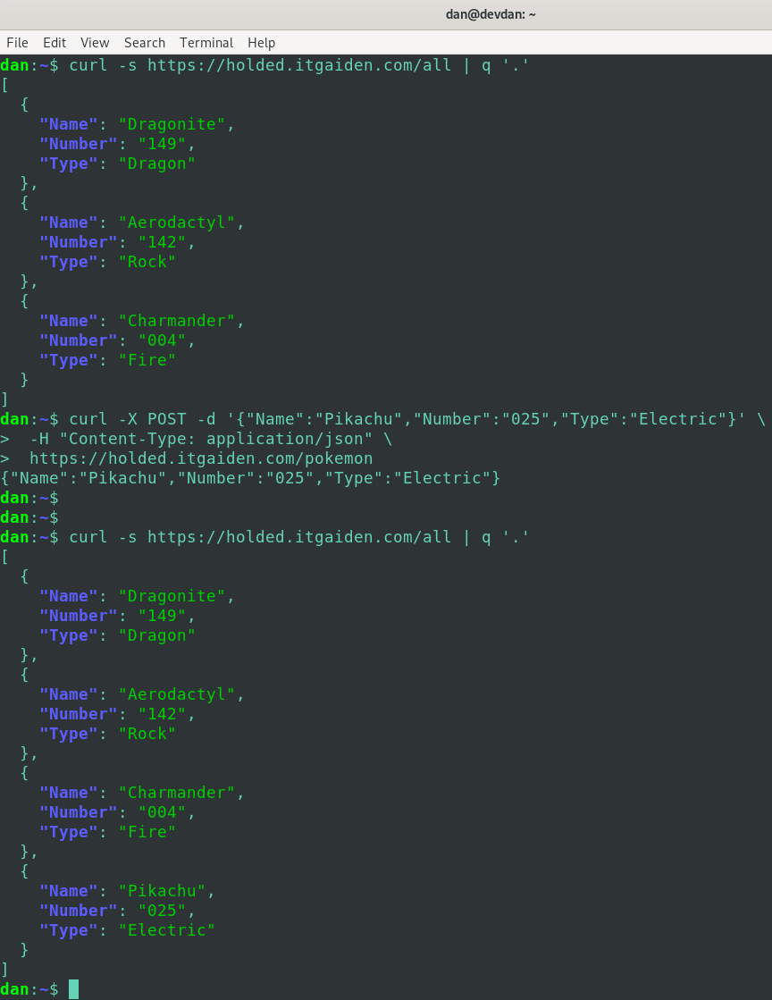
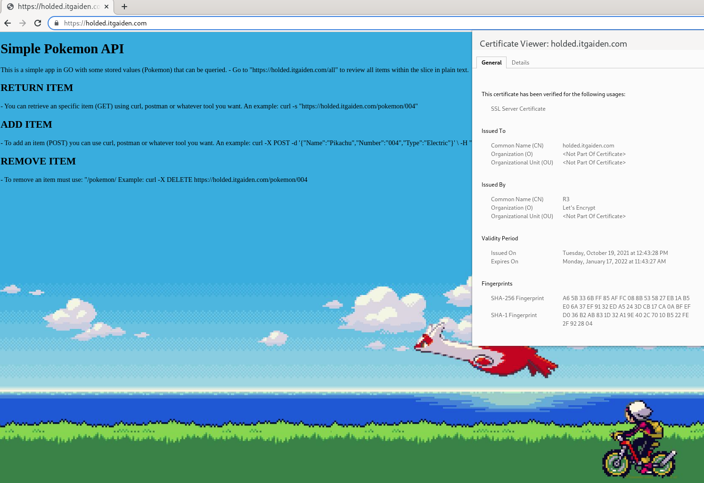

# Requisites

- A GitHub account obviously.
- Terraform installed (v1.0.8 used)
- A GCP account with a **project already created and Billing linked**. 
Your user should have full permissions although **a SA is recommended** when using Terraform as well. I **will use it ony for CI/CD pipeline **i n GH action.
- Install and configure [gcloud-sdk](https://cloud.google.com/sdk/docs/quickstarts)
- **kubectl** installed
- For the CI/CD pipeline in GH actions I have created a SA as specified [here](https://cloud.google.com/iam/docs/creating-managing-service-accounts) with the appropiate permissions. 
- If you want to use ACME, you will need a **public domain registered** and perform additional configurations (depending on how you wantH to do it).

*Here I'll be using the HTTP01 challenge as the DNS01 has issues when domain and K8s cluster are not in the same cloud provider*

# Installation (GCP infrastructure bootstrap)

### Login to GCP with gcloud

Remember that you need the gcloud-sdk installed in your machine, once it's installed, you can log into your account using:
```bash
 gcloud auth application-default login
```

A window from your web browser will pop-up, select your account and now you're logged. Your credentials will be saved in your home directory in JSON format.

Now, configure your gcloud with `gcloud init`.

Once you're logged and configured, you can continue.

### Deploy with Terraform

To deploy all the infrastructure withink GCP, we will use terraform which help us to deploy the needed resource to setup a GKE cluster.

- Clone the repository: `git clone https://github.com/dangaiden/cicd-go.git`
- Change to the "infra" directory and Iniatalize providers: 
`cd cicd-go/infra` and `terraform init`
- And then perform: `terraform plan && terraform apply -auto-approve`
> This can take about 10 minutes to be deployed.

This will deploy the following componentes:

- A functionally public GKE cluster.
- 2 Helm releases with Nginx (1.0.0) and Cert-manager (1.5.3) installed.
- With the NGINX (ingress controller) release, will imply that an External IP address and a L4 (TCP) LB will be deployed in GCP.
- An initial version of a Go version (Golang icon) which differs a lot (is pulled from another repository) from the image used with GH actions.

# Kubernetes deployment

Despite you can use the *Kubernetes or Kubectl* providers, each has it's own drawbacks so I decided it will be easier to use
kustomize/kubectl in order to apply our custom manifests.

After the GCP infrastructure has been deployed, proceed to renew your kube config file by executing:
```bash
gcloud container clusters get-credentials <gke-cluster-name>
export KUBE_CONFIG_PATH=~/.kube/config
```

Now, to deploy our custom application with some ingress rules execute:

```bash
kubectl apply -f ../k8s/custom-manifests/
```

It will configure an application with a service and ingress.

In this repository, you must use a public domain and point it to the external IP from the LB (You can gather it with: `kubectl get svc -n ingress | grep -a1 EXTERNAL-IP`) as the ingress routes is waiting for a host.

In my case I created an A Record ("subdomain".itgaiden.com) in my hosted zone, pointing to the external IP from the Ingress controller.

After a minute or so, if everything is correct, your app will be secured with a certificate from Let's Encrypt! that will be trusted publicly.

>The main webpage for the Go application is: https://holded.itgaiden.com/

# Infrastructure 

This is an overview of the infrastructure deployed in GCP:



# General flowchart 
Once the infrastructure has been deployed and the manifests applied, this will be the flowchart that will follow the CI/CD pipeline when someone commits a change to repository in some specific folders :



# GitHub Actions

This is an overview of the CI/CD pipeline in GH actions:



In GitHub Secrets you must add the credentials (JSON format) for a Service Account (SA) to run the pipelne and the GCP project ID (optional).

The SA must have appropiate permissions to push to the GCR and the GKE cluster.

The jobs executed are:
- CI-1-Unit-test 

This job executed a really simple unit test in our Go application.

- CI-2-Setup-Build-Publish

It builds the docker image (in the local repository) if the previous job was successful. Then is tested with a shell script and once it's confirmed that it works correctly, is being pushed to the public repository (Google Container Registry).

- CD-Deploy

This last job which will be executed once the last one is successful will deploy a new rollout with the new image that has been published in the Google Container Registry.

It's been deployed with kustomize to ensure we can have a more controlled roll out and finally we check that it has been correctly deployed.

# API Demonstration

Here are some examples of what can be performed within the API.

- Gathering different elements:



- Retrieveing all items and deleting one of them:



- List all and then add a new element:



In the default path (/), you will find this lovely welcome page **secured with Let's Encrypt!**:



# Problems found

### ACME with DNS01 challenge

DNS01 Challenge with domain in Route53 and K8s cluster in GKE was unsucessful:
``` bash
wildcard is not authorized to perform: sts:AssumeRole on resource: arn:aws:iam::xxxxxx:policy/DNS-Route53-role
           status code: 403, request id: e1bb82af-1811-4fd2-a38b-bsasdfasdf1
```

I've even tried to delegate a subdomain (go.itgaiden.com) from Route53 to Google Cloud DNS but no success:
``` bash
 Warning  PresentError  4m50s (x7 over 9m57s)  cert-manager  Error presenting challenge: When querying the SOA record for the domain '_acme-challenge.go.itgaiden.com.' using nameservers [10.8.0.10:53], rcode was expected to be 'NOERROR' or 'NXDOMAIN', but got 'SERVFAIL'
```
In the official [documentation](https://cert-manager.io/docs/configuration/acme/dns01/route53/) seems to state that assume the cluster is in AWS, therefore, although there could be people that accomplished in the past, for some reason now doesn't seem possible although I have spent a lot of time on this.

TLDR: It didn't worked with DNS01 challenge but with HTTP01 challenge had no problem.

### Using Traefik v2.x.x and "PathPrefix" rule not working correctly.

Although it works correctly out of the box, for some reason, when using only "PathPrefix", it didn't redirect correctly:
```
routes:
    - match: (PathPrefix(`/something`) || PathPrefix(`/somethingelse`))
    kind: Rule
```
For me, only worked on rules with "Host" match like: `Host(`itgaiden.com`)`

I spent some time with this and I finally decided to move to **Nginx, which worked flawlessly**.


# Sources used

- https://cloud.google.com/community/tutorials/nginx-ingress-gke
- https://registry.terraform.io/providers/hashicorp/google/latest
- https://cert-manager.io/docs/
- https://tutorialedge.net/golang/creating-restful-api-with-golang/
- https://docs.github.com/en/actions/learn-github-actions/workflow-syntax-for-github-actions
